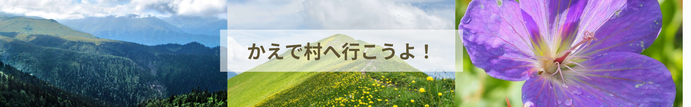
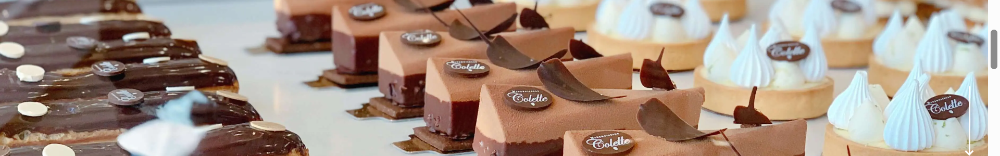

## プロフィール

| 項目 | 内容 | リンク |
|------|------|--------|
| システム開発の実務経験 | 8年 | [➤](./profile/system_dev.md) |
| WEBサイト制作受講 | 6か月 | [➤](./profile/web_training.md) |
| 東京都主催デジタルスキル受講 | 1か月 | [➤](./profile/digital_skill.md) |
| Udemy「Python講座」 | 学習中 | [➤](https://github.com/python-works-project/python-udemy-practice) |
| 生成AIパスポート | 2025年10月取得 | [➤](./profile/ai_passport.md) |
| JDLA G検定 | 2025年11月合格 | [➤](./profile/g_test.md) |
---

## ポートフォリオ

### `Python`
**[Udemy学習ログ](https://github.com/python-works-project/python-udemy-practice)**  
Python学習における作成コードやポイントをまとめています。

---

### `HTML / CSS / JavaScript`

#### 🌸 Sunday Flower
  
学習のために作成した架空の花屋サイトです。

---

#### 🍁 Maple Villege
  
学習のために作成した架空の観光サイトです。

---

#### 🧁 Chalon
  
職業訓練校の講座内で作成した課題サイトです。

