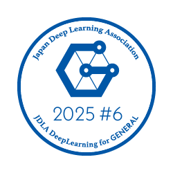
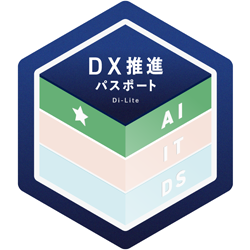

## １．スキル・経歴

| スキル・経歴 | 期間 |  |
|---|---|---|
| システム開発の実務経験 | 8年 | [詳細](./profile/system_dev.md) |
| 『WEBサイト制作講座』受講 | 6か月 | [詳細](./profile/web_training.md) |
| 『デジタルスキル講座』受講 | 1か月 | [詳細](./profile/digital_skill.md) |
| 『Python』受講中 | 学習中 | [詳細](https://github.com/python-works-project/python-udemy-practice/blob/main/README.md) |

---

## ２．保有資格・オープンバッジ

  
  
  
 

| 資格名 | 取得年月 | 詳細 |  | 
|---|---|---|---|
| JDLA G検定 | 2025年11月 | [詳細](./profile/g_test.md) | [資格の説明](#g検定) |
| 生成AIパスポート | 2025年10月 | [詳細](./profile/ai_passport.md) | [資格の説明](#生成aiパスポート) |
| VBAエキスパート | 2019年7月 | [詳細](./profile/vba_standard.md)  | [資格の説明](#VBA-standard) |

| JDLA Deep Learning for GENERAL 2025 #6 | VBAエキスパート Excel VBA Standard | DX推進パスポート１ |
|---|---|---|
|  |  |   |
| [バッジの説明](#jdla-deep-learning-for-general-2025-6) |  |  |

---

## ３．ポートフォリオ

### `Python`
**[学習ログ](https://github.com/python-works-project/python-udemy-practice/blob/main/README.md)**  
Python学習における作成コードやポイントをまとめています。

### `HTML / CSS / JavaScript`
| サイト名 | サイトイメージ | 説明 |
|---|---|---|
| [Sunday Flower](https://web-works-project.github.io/web-sunday-flower/) |  | 学習のために作成した架空の花屋サイトです。 |
| [Maple Villege](https://web-works-project.github.io/web-maple-villege/) |  | 学習のために作成した架空の観光サイトです。 |
| [Chalon](https://web-works-project.github.io/web-chalon/) |  | 職業訓練校の講座内で作成した課題サイトです。 |

<h2 id="badge-info">資格・バッジの説明</h2>

  
#### ` G検定 `
 [公式サイト](https://www.jdla.org/certificate/general/)   より  
G検定とは、一般社団法人日本ディープラーニング協会（JDLA）が実施する、AI・ディープラーニングの活⽤リテラシー習得のための検定試験です。 AI・ディープラーニングに関わる全ての方が受験対象です。 AI・ディープラーニングについて体系的に学ぶことで、「AIで何ができて、何ができないのか」「どこにAIを活用すればよいか」「AIを活用するためには何が必要か」が理解でき、データを活用した新たな課題の発見やアイデアの創出が可能になる、デジタル施策の推進に自信が持てるようになるなど、あなたのビジネスやキャリアの可能性が飛躍的に広がります。

#### ` 生成AIパスポート `  
[公式サイト](https://guga.or.jp/outline/)  より  
生成AIパスポートは、生成AIリスクを予防する日本最大級（※）の資格試験です。生成AIに関する基礎知識や動向、活用方法に加え、情報漏洩や権利侵害などの注意点まで網羅し、AI初心者が最低限押さえておきたいリテラシーを体系的に習得できます。本資格の提供を通じて、生成AIの安全な活用に必要なリテラシーを有する企業・人材を可視化し、日本社会におけるAIリテラシーの標準化を推進します。  
※2025年9月時点で発表されている生成AI関連の資格試験や検定の受験者数に基づく

#### ` VBA standard `
[公式サイト](https://vbae.odyssey-com.co.jp/about/)  より  
Excel、Accessのマクロ・VBA（Visual Basic for Applications）のスキルを証明する資格です。

### ` JDLA Deep Learning for GENERAL 2025 #6 `
発行者：一般社団法人　日本ディープラーニング協会
発行日：2025/12/12
説明　：「JDLA Deep Learning for GENERAL (G検定)」とは、ディープラーニングの基礎知識を有し、適切な活用方針を決定して、事業活用する能力や知識を有しているかを検定する試験です。

###  ` VBAエキスパート Excel VBA Standard `
発行者：株式会社 オデッセイコミュニケーションズ
発行日：2019/07/05
説明　：『VBAエキスパート』は、ExcelとAccessのマクロ・VBAのスキルを証明する資格試験です。株式会社オデッセイコミュニケーションズが認定・実施しています。どのバージョンのOfficeアプリケーションにも共通する機能や、プログラムコードを重視しており、実践的なスキルを客観的に証明する資格試験です。 このバッジの取得者は、『VBAエキスパート Excel VBAスタンダード』に合格にしています。

#### ` DX 推進パスポート `
発行者：デジタルリテラシー協議会
発行日：2026/01/15
説明　：DX推進を目指す全ての人は、デジタルを「使う」と「作る」を行ったり来たりするための知識が更に必要となります。そのためには、デジタル・ITの基礎的知識に加えて、データサイエンスとAIの知識もより深く求められてきます。 DX推進パスポートは、DX推進に取り組むチームの一員として作業を担う人を対象に、DXを推進するプロフェッショナル人材となるために必要な基本的スキルを有することを証明するデジタルバッジで、 デジタルリテラシー協議会が推奨する「ITパスポート試験」、「データサイエンティスト検定 リテラシーレベル」、「G検定」の3つの試験の合格数に応じて発行しています。 「DX推進パスポート１」は、これら3つの試験のうちいずれか1つの合格者に発行するものです。

**説明**  
DX推進を目指す全ての人は、デジタルを「使う」と「作る」を行ったり来たりするための知識が更に必要となります。そのためには、デジタル・ITの基礎的知識に加えて、データサイエンスとAIの知識もより深く求められてきます。 DX推進パスポートは、DX推進に取り組むチームの一員として作業を担う人を対象に、DXを推進するプロフェッショナル人材となるために必要な基本的スキルを有することを証明するデジタルバッジで、 デジタルリテラシー協議会が推奨する「ITパスポート試験」、「データサイエンティスト検定 リテラシーレベル」、「G検定」の3つの試験の合格数に応じて発行しています。 「DX推進パスポート１」は、これら3つの試験のうちいずれか1つの合格者に発行するものです。
**取得条件**  
「DX推進パスポート1」は、デジタルリテラシー協議会（Di-Lite）が推奨する次の3つの試験のいずれか1つに合格し、申請された方に発行します。
　＜Di-Lite推奨試験＞
　　- ITパスポート試験（2021年4月以降に実施した試験の合格者）
　　- データサイエンティスト検定 リテラシーレベル
　　- G検定
