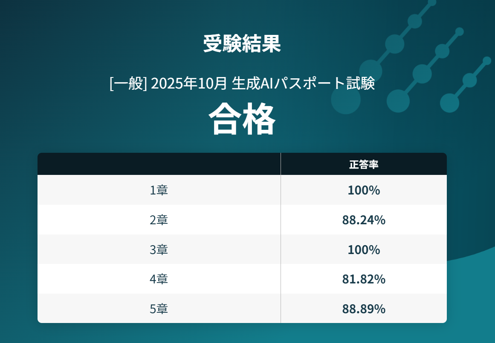

## ■章別得点率

| No. | 分野 | 得点率 |
|-----|------|--------|
| 1 | AI（人工知能） | 100% |
| 2 | 生成AI（ジェネレーティブAI） | 88.24% |
| 3 | 現在の生成AI（ジェネレーティブAI）の動向 | 100% |
| 4 | 情報リテラシー・基本理念とAI社会原則 | 81.82% |
| 5 | テキスト生成AIのプロンプト制作と実例 | 88.89% |
