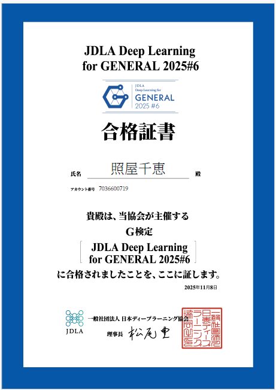

## ■分野別得点率（小数点以下切り捨て）

| No. | 分野 | 得点率 |
|-----|------|--------|
| 1 | 人工知能とは・人工知能をめぐる動向 | 100% |
| 2 | 機械学習の概要 | 88% |
| 3 | ディープラーニングの概要 | 95% |
| 4 | ディープラーニングの要素技術 | 93% |
| 5 | ディープラーニングの応用例 | 90% |
| 6 | AIの社会実装に向けて | 81% |
| 7 | AIに必要な数理・統計知識 | 100% |
| 8 | AIに関する法律と契約・AI倫理・AIガバナンス | 91% |

